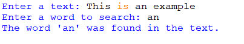
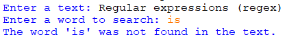

## Description
The Python program search_word.py prompts the user to input a text and a word. It then uses regular expressions to search for the provided word within the given text. If the word is found, it displays a message indicating its presence; otherwise, it notifies the user that the word was not found in the text.
## Examples
♡ Example 1 :  

  

♡ Example 2 :  

